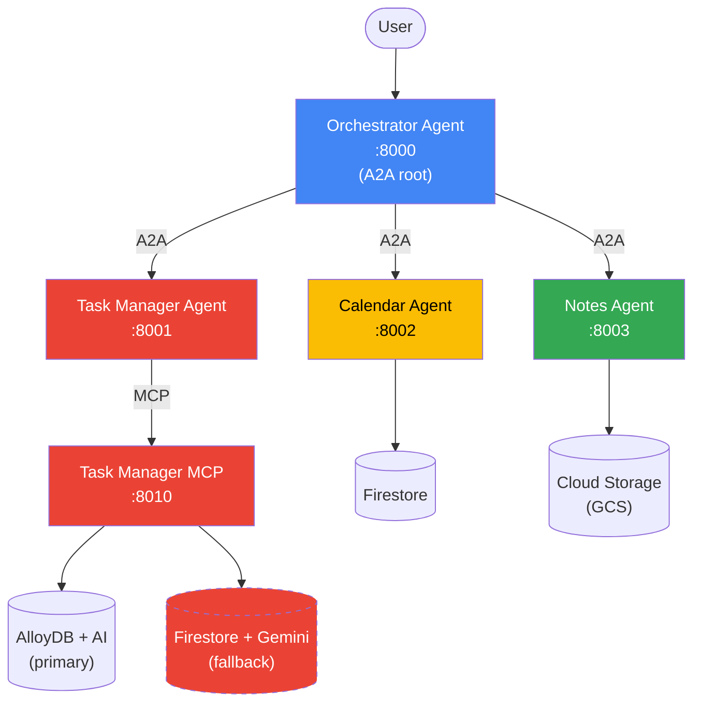

# Project

Project done for hackathon associated with Google Cloud - Generative AI.

Multi-Agent Project Manager Assistant built with Google ADK, A2A protocol, and Vertex AI (Gemini).

## Architecture

## Agents

| Service | Port | Description |
|---|---|---|
| **Orchestrator Agent** | 8000 | Root agent that coordinates all sub-agents. Delegates user requests to the task, calendar, and notes agents via A2A, handling fan-out, sequential chaining, and cross-agent workflows. |
| **Task Manager Agent** | 8001 | Manages tasks (CRUD, semantic search, smart filtering, summaries) by connecting to the Task Manager MCP Server. |
| **Calendar Agent** | 8002 | Schedule management agent backed by Firestore. Supports creating, listing, searching, and updating events, plus free-slot detection. Pre-seeded with demo data. |
| **Notes Agent** | 8003 | Markdown note management agent backed by Google Cloud Storage. Supports saving, reading, listing, and searching notes. |
| **Task Manager MCP** | 8010 | MCP server (Streamable HTTP) with **dual-backend** support. Tries AlloyDB at startup; falls back to Firestore + Gemini API if unreachable. Exposes task CRUD plus AI tools (vector search, smart filter, summary generation). |
